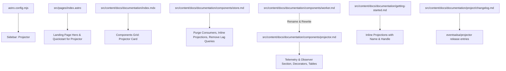

# Implementation Plan - eventsalsa/projector Documentation & Store Consumer Purge

Update the `eventsalsa` documentation and website to reflect the latest upstream architectural changes across `eventsalsa/store` and `eventsalsa/projector` (formerly `eventsalsa/worker`).

## Goal Description

Upstream repositories have undergone significant architectural refinements:
1. `eventsalsa/worker` has been renamed to `eventsalsa/projector`.
2. The `Consumer` and `ScopedConsumer` interfaces have been **completely removed** from `eventsalsa/store`.
3. The Projector component now defines the canonical `Projection` interface (`Name()` and `Handle(ctx context.Context, tx pgx.Tx, event store.PersistedEvent) error`).
4. Projections are filtered dynamically using decorators like `FilterStreamTypes` and `FilterEventTypes`.
5. A comprehensive **Observability and Telemetry** feature has been added to `eventsalsa/projector` (`Observer` interface, `BatchStats`, `DaemonStats`, `GapStats`, `NoopObserver`, `MultiObserver`, and Prometheus metrics recipe).
6. Legacy manual SQL lag queries in `store.md` ("Tracking projection lag") are obsolete and must be removed.

This plan details all changes across website pages, documentation chapters, navigation, changelog, and agent configurations.

---

## User Review Required

> [!IMPORTANT]
> - **URL / Slug Change**: Renaming `documentation/components/worker/` to `documentation/components/projector/`. `astro.config.mjs`, internal links, and index cards will be updated accordingly.
> - **Changelog Strategy**: In `changelog.md`, the component will be documented as `eventsalsa/projector` (dismissing the historical rename to maintain clean, consistent terminology for users).
> - **No Backward Compatibility Language**: As requested, documentation will present the current state as the standard design without historical apologetics (e.g. no "there is no more Consumer interface").

---

## Proposed Changes



---

### Navigation & Astro Configuration

#### [MODIFY] [astro.config.mjs](astro.config.mjs)
- Update the sidebar component item from `{ label: 'Worker', slug: 'documentation/components/worker' }` to `{ label: 'Projector', slug: 'documentation/components/projector' }`.

---

### Component Documentation

#### [DELETE] [src/content/docs/documentation/components/worker.md](src/content/docs/documentation/components/worker.md)
- Remove old worker documentation file upon creating `projector.md`.

#### [NEW] [src/content/docs/documentation/components/projector.md](src/content/docs/documentation/components/projector.md)
- Complete, authoritative guide for `eventsalsa/projector`:
  - **Module Installation**: `go get github.com/eventsalsa/projector`.
  - **Migration Generation**: CLI `go run github.com/eventsalsa/projector/cmd/migrate-gen` and programmatic `migrations.GeneratePostgres`.
  - **Metadata Tables**: `projector_instances`, `projection_assignments`, `projection_checkpoints`, `projection_gap_skips`, `projector_leader_leases`.
  - **Projection Interface**:
    ```go
    type Projection interface {
        Name() string
        Handle(ctx context.Context, tx pgx.Tx, event store.PersistedEvent) error
    }
    ```
  - **Stream and Event Filtering**:
    ```go
    projections := []projector.Projection{
        projector.FilterStreamTypes(&OrderOverviewProjection{}, "Order"),
    }
    ```
  - **Daemon Lifecycle & Configuration**: `projector.New(...)`, functional options (`WithBatchSize`, `WithBatchPause`, `WithBatchTimeout`, `WithMaxConsecutiveFailures`, `WithPollInterval`, `WithMaxPollInterval`, `WithDispatcherInterval`, `WithHeartbeatInterval`, `WithHeartbeatTimeout`, `WithRebalanceInterval`, `WithStaleGapThreshold`, `WithStaleGapHarborLag`, `WithDispatcherStrategy`, `WithLeaderStrategy`, `WithObserver`, etc.).
  - **Leader Election & Connection Pooling**: Advisory locks vs lease tables (`projector.LeaderStrategyLease`), PgBouncer transaction-pooling compatibility, and supported query execution modes (`SimpleProtocol`, `Exec`, `DescribeExec`, `CacheDescribe`).
  - **Gaps, Frontiers, and Safe Progress**: Unscoped frontier probing and `projection_gap_skips` safe-harbor recovery.
  - **Observability and Telemetry**: Pluggable `projector.Observer` interface, `BatchStats`, `DaemonStats`, `GapStats`, `NoopObserver`, `MultiObserver`, and complete Prometheus metrics recipe (`PrometheusObserver`).

#### [MODIFY] [src/content/docs/documentation/components/store.md](src/content/docs/documentation/components/store.md)
- **Purge Consumer Concepts**: Remove all imports and references to `github.com/eventsalsa/store/consumer`, `Consumer`, and `ScopedConsumer`.
- **Inline Projections**: Frame read models around inline projections running inside the append transaction for strong consistency:
  ```go
  type OrderOverviewProjection struct{}

  func (p *OrderOverviewProjection) Name() string {
      return "order_overview_v1"
  }

  func (p *OrderOverviewProjection) Handle(ctx context.Context, tx pgx.Tx, event store.PersistedEvent) error {
      // Decode and update SQL read model atomically
  }
  ```
  Note that implementing `Name()` and `Handle(...)` ensures the projection can seamlessly transition to `eventsalsa/projector` for asynchronous eventual consistency when needed.
- **Remove Legacy Lag Tracking**: Completely remove `### Tracking projection lag` and the manual `ProjectionLag` SQL query.
- **Update Async Links**: Point all references to asynchronous processing to `../projector/`.

#### [MODIFY] [src/content/docs/documentation/components/encryption.md](src/content/docs/documentation/components/encryption.md)
- Update references from `eventsalsa/worker` to `eventsalsa/projector`.

---

### Guides & Landing Pages

#### [MODIFY] [src/content/docs/documentation/getting-started.md](src/content/docs/documentation/getting-started.md)
- In "Maintain a read model inline":
  - Remove all references and imports of `github.com/eventsalsa/store/consumer`.
  - Present `OrderOverviewProjection` as an inline projection struct implementing `Name() string` and `Handle(ctx context.Context, tx pgx.Tx, event store.PersistedEvent) error`.
  - Update inline execution example.
- In "Where to go next":
  - Update link from `Worker` to `[Projector](../components/projector/)`.

#### [MODIFY] [src/content/docs/documentation/index.mdx](src/content/docs/documentation/index.mdx)
- Update component card from `eventsalsa/worker` to `eventsalsa/projector` with href `./components/projector/`.

#### [MODIFY] [src/pages/index.astro](src/pages/index.astro)
- Update `featureCards`: `eventsalsa/projector`, description, and link to `${baseUrl}documentation/components/projector/`.
- Update `benefits`: "The store and projector are built on PostgreSQL...".
- Update code block snippet `projectorCodeLines`:
  ```go
  type AccountProjection struct{}

  func (p *AccountProjection) Name() string {
      return "account_projection"
  }

  func (p *AccountProjection) Handle(ctx context.Context, tx pgx.Tx, event store.PersistedEvent) error {
      return nil
  }

  daemon := projector.New(
      db,
      eventStore,
      []projector.Projection{
          projector.FilterStreamTypes(&AccountProjection{}, "Account"),
      },
      projector.WithBatchSize(100),
      projector.WithPollInterval(500 * time.Millisecond),
  )

  if err := daemon.Start(ctx); err != nil {
      return err
  }
  ```
- Update Quickstart section: title `eventsalsa/projector`, install card `go get github.com/eventsalsa/projector`, copy, and bullet points.

---

### Project & Agent Context

#### [MODIFY] [src/content/docs/documentation/project/changelog.md](src/content/docs/documentation/project/changelog.md)
- Rename `## eventsalsa/worker` &rarr; `## eventsalsa/projector`.
- Refine historical notes to use `eventsalsa/projector` and projection terminology consistently.

#### [MODIFY] [.agents/rules/docs.instructions.md](.agents/rules/docs.instructions.md)
- Update rule from `eventsalsa/worker` to `eventsalsa/projector`.

#### [MODIFY] [.agents/skills/eventsalsa-domain-context/SKILL.md](.agents/skills/eventsalsa-domain-context/SKILL.md)
- Update component list: `eventsalsa/projector: async projections and distributed daemon`.

---

## Verification Plan

### Automated Tests
1. **Build Validation**:
   ```bash
   rtk npm run build
   ```
   Ensures all Astro components, markdown frontmatter, Starlight routes, and asset references build cleanly with zero errors.

### Manual Verification
1. **Link Integrity Check**: Verify that navigation between `/documentation/`, `/documentation/getting-started/`, `/documentation/components/store/`, `/documentation/components/projector/`, `/documentation/components/encryption/`, and `/documentation/project/changelog/` works seamlessly without 404s.
2. **Visual Consistency**: Confirm landing page code snippet and quickstart cards render with proper syntax highlighting and layout balance.
